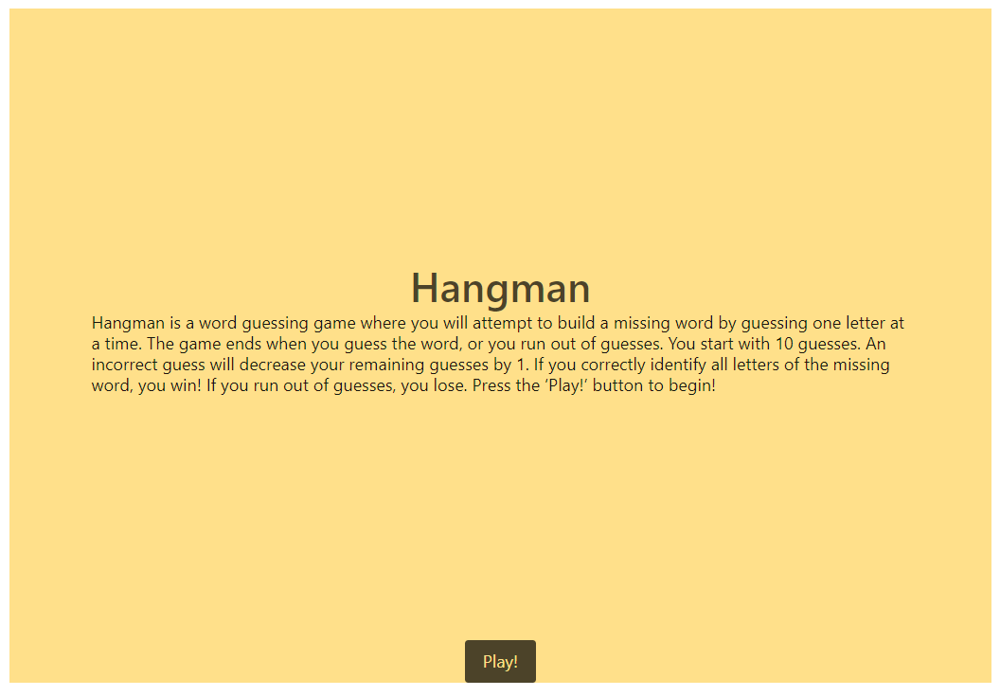
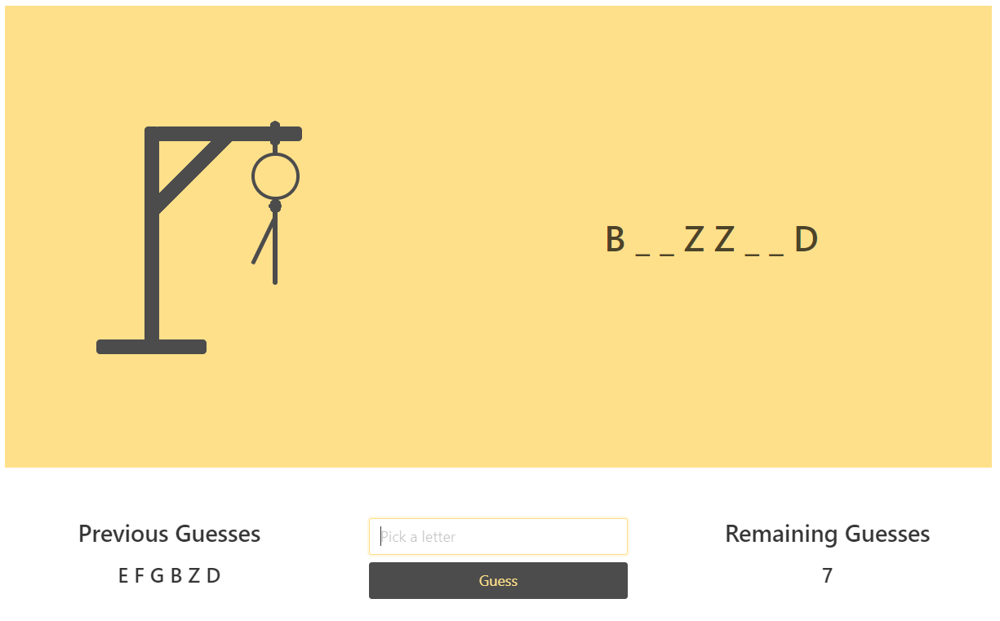
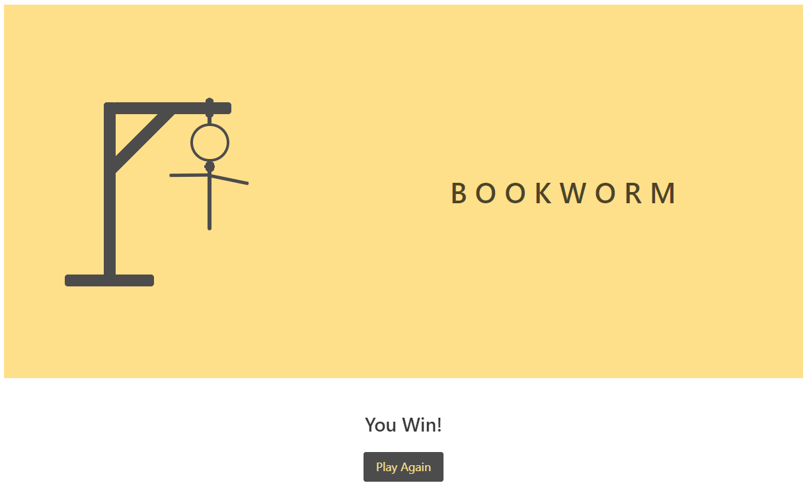
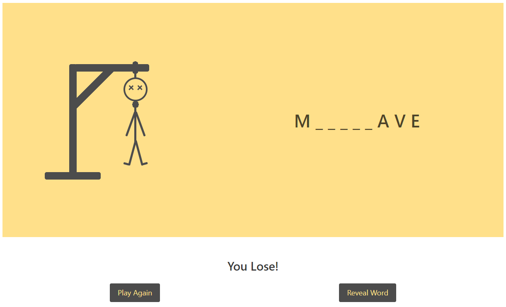

# Hangman

## Description
Hangman is a word guessing game where you will attempt to build a missing word by guessing one letter at a time. The game ends when you guess the word, or you run out of guesses. You start with 10 guesses. An incorrect guess will decrease your remaining guesses by 1. If you correctly identify all the letter of the missing word, you win! If you run out of guesses, you lose. Guess the word and save the person! Press the ‘Play!’ button to begin!

[Deployed Application](https://spreston4.github.io/hangman/)

[GitHub Repo](https://github.com/spreston4/hangman)

## Technologies used
Built in Visual Studio with:
* Javascript / jQuery
* CSS / Bulma.io 
* HTML

This was my first attempt at drawing and animating with CSS. Fun project!

## To-Dos:
* Replace form input with virtual keyboard input method
* ~~Add drawing of the 'hangman' to update with incorrect guesses~~
* Add functionality to pick category
* Mobile formatting

## How to
When the application is loaded, the user is presented with the following screen. Press the 'Play!' button to begin!

A random word is selected and a hidden version is displayed to the page. To guess a letter, the user must input a character(A-Z) into the search bar. Pressing the 'Guess' button with submit the guess.  Previously guessed letters are displayed in the 'Previous Guesses' section. Remaining guesses are displayed in the 'Remaining Guesses' section. For each incorrect guess, an additional body part is added to the hanging man.

If the user correctly guesses all letters, the win screen is displayed. Pressing the 'Play Again' button will reset the game.

If the user runs out of guesses, the lose screen is displayed. Pressing the 'Play Again' button will reset the game. Pressing the 'Reveal Word' button will show the word on the screen.

## Contact Me
GitHub: [spreston4](https://github.com/spreston4)

E-mail: [sam.preston11@gmail.com](mailto:sam.preston11@gmail.com)